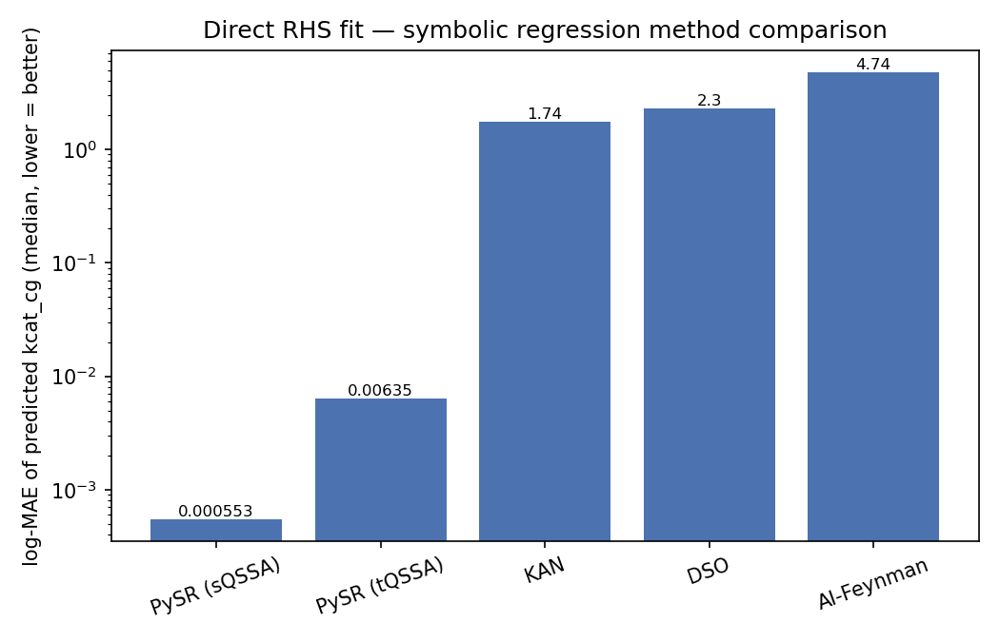
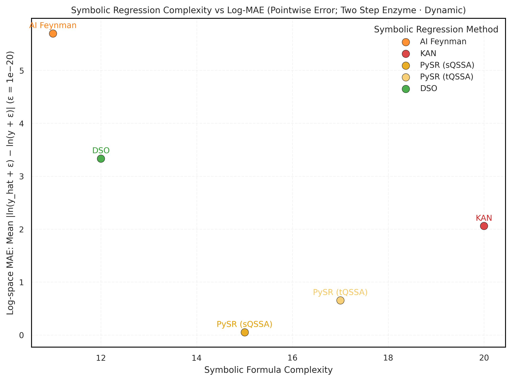

# SR-benchmark results — `two_step_enzyme` (dynamic)

Symbolic-regression method comparison for predicting `kcat_cg` from the enzyme
parameters `{P_u, k_off, k_D, k_cat, tK, k_inact}`. Produced by the snakemake
`sr_comparison` pipeline on NEMO (x86), seed 42, restricted operator set.

Canonical outputs live under (gitignored) `data/two_step_enzyme/dynamic/sr_comparison/`:
`results/formula_*.txt`, `results/rhs_loss_comparison.csv`, `plots/rhs_comparison.png`.

## Direct RHS fit (no ODE integration)

How well each formula predicts `kcat_cg` on the full 432,542-row test set,
`log-MAE = mean|log(pred) − log(kcat_cg)|` (lower is better):

| Rank | Method | log-MAE mean | log-MAE median |
|:-:|--------|:-:|:-:|
| 1 | **PySR (sQSSA)** | **0.054** | **0.0006** |
| 2 | PySR (tQSSA) | 0.657 | 0.0063 |
| 3 | KAN | 2.06 | 1.74 |
| 4 | DSO | 3.33 | 2.30 |
| 5 | AI-Feynman | 5.70 | 4.74 |



### Complexity vs accuracy

Formula complexity (node count) vs the same direct log-MAE — `results_plot.png`
from the `plot_methods` rule. PySR (sQSSA) is Pareto-optimal (lowest error at
moderate complexity); KAN is the most complex (its 6-term power law); AI-Feynman
and DSO are simplest but least accurate.



## Discovered formulas

**PySR (sQSSA)** — clean Michaelis-Menten rational; essentially exact (median ~0.06%):
```
kcat_cg = P_u·tK·k_D / ( k_D·P_u + (k_cat + k_inact)/k_off + 1.0006 )
```

**PySR (tQSSA)**:
```
kcat_cg = P_u·tK·k_D / ( k_D·P_u + (k_cat+k_inact)/k_off + k_D·tK·0.984 − 0.507 + 1.507 )
```

**KAN** — power law (inputs are log-scale; a linear-in-log fit):
```
log(kcat_cg) = 0.860·log(P_u) + 0.644·log(k_off) + 0.854·log(k_D)
             − 0.227·log(k_cat) + 0.988·log(tK) − 0.221·log(k_inact) − 5.568
```

**DSO** — log of a rational:
```
kcat_cg = P_u·k_D·tK / ( k_off + k_cat/k_off )
```

**AI-Feynman** — finds the MM saturation term `k_cat/(tK+k_cat)` but wraps it
(√ leaked in from its polyfit/snap stage), which caps its accuracy:
```
kcat_cg = exp( −6.24·( √(k_cat/(tK+k_cat)) + 1 ) )
```

## Operator sets (this run)

All non-PySR methods were restricted to `{+, −, ×, ÷, log}` to match PySR's
rational basis:

- **PySR**: binary `+ − × ÷`; sQSSA no unary, tQSSA `{sqrt, square}`; log-space
  custom loss `(log x − log y)²`.
- **KAN**: symbolic library `{x, log}` on log inputs (so `+,−,×,÷` are native in
  log space).
- **DSO**: function set `{add, sub, mul, div, log}`.
- **AI-Feynman**: brute-force ops `+ * - / L`; all non-log "world" transforms
  disabled (see caveat below re: a residual √).

## Reproducibility

Seed 42 is passed to every method (data subsample `random_state=42` + framework
RNG; DSO's `experiment.seed` too). PySR determinism is env-scoped (bit-identical
on the same machine/env). TF1.14/torch/AI-Feynman-Fortran retain minor
nondeterminism, but the dominant source (random data subsample) is fixed.

## Reproduce

```bash
# NEMO, from the repo root; ncpu compute node
bash scripts/setup_dso.sh                       # fetch DSO source into src/dso
snakemake --use-conda --rerun-triggers=mtime -c8 \
  data/two_step_enzyme/dynamic/sr_comparison/results/rhs_loss_comparison.csv
```
(See `docs/nemo_sr_benchmark_runbook.md` for the full environment setup.)

## Vendor-code note

The SR packages are used unmodified (no source edits): **PySR, KAN (pykan), DSO**
run purely through their public APIs + config. **AI-Feynman** is the exception —
its source is unmodified on disk, but `aifeynman_model.py` monkeypatches ~14 of
its functions at runtime (to skip the crash-prone/slow generalized-symmetry and
compositionality stages, and to enforce the operator restriction), because the
package exposes no config hooks for either. A residual `√` in the AI-Feynman
formula comes from its polyfit/snap stage, which the transform-disabling does not
cover — so the operator restriction is not 100% airtight for AI-Feynman.
